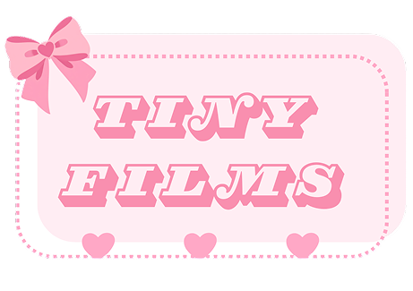

# 🎀 TinyFilms Photobooth

A cute, browser-based photobooth app — pick a film-strip frame, snap or upload photos, then decorate your strip with stickers. Everything is composited live on an HTML5 canvas so you get a downloadable, shareable final image.



## ✨ Features

- 📷 **Live webcam capture** with a 3-second countdown, or upload your own photos
- 🖼️ **Frame selection** — choose from a variety of pastel/aesthetic film-strip frames
- 🎨 **Drag-and-drop editing** — reposition photos within their slots after capture
- 🧷 **Sticker decoration mode** — add, drag, select, and delete stickers on your strip
- ⌨️ **Keyboard support** — delete a selected sticker with `Backspace`/`Delete`
- 🔁 **Redo/retake** — remove the last photo and recapture if you're not happy with it
- 💅 Fully custom, playful UI styled to match the TinyFilms brand

## 🛠️ Tech Stack

- **React** (functional components + hooks: `useState`, `useRef`, `useEffect`)
- **react-webcam** for camera access and screenshot capture
- **HTML5 Canvas API** for compositing photos, frames, and stickers
- **CSS Modules** for scoped component styling

## 📁 Project Structure

```
src/
├── components/
│   └── Photobooth/
│       ├── Photobooth.js          # Main app logic & canvas rendering
│       ├── Header.js              # Title bar + back navigation
│       ├── FrameSelector/         # Frame picker carousel
│       ├── PhotoCapture/          # Webcam + upload controls
│       ├── PhotoCanvas/           # Canvas element wrapper
│       └── StickerPicker/         # Sticker grid picker
├── data/
│   ├── frameOptions.js            # List of available frame image paths
│   └── stickerOptions.js          # List of available sticker image paths
└── styles/
    └── global.css

public/
└── assets/
    ├── frames/                    # Frame PNGs
    ├── stickers/                  # Sticker PNGs
    └── fonts/                     # Custom fonts (Fredoka, Magnifico)
```

## 🚀 Getting Started

### Prerequisites

- [Node.js](https://nodejs.org/) (v16 or later recommended)
- npm or yarn

### Installation

```bash
# Clone the repo
git clone https://github.com/your-username/tinyfilms-photobooth.git
cd tinyfilms-photobooth

# Install dependencies
npm install

# Start the development server
npm start
```

The app will be running at `http://localhost:3000`.

> **Note:** Your browser will ask for camera permission on first use — this is required for the webcam capture feature to work.

## 🖥️ Usage

1. **Select a frame** from the carousel on the home screen.
2. **Take or upload 4 photos** to fill the frame's photo slots — drag each photo within its slot to reposition it.
3. Once all 4 slots are filled, you're moved into **decorate mode** — pick stickers from the picker and drag them anywhere on your strip.
4. Click a sticker to select it (shown with a pink outline), then press `Delete`/`Backspace` to remove it.
5. Use the **Back** button to return to the previous step at any time.

## 🎨 Adding Your Own Frames or Stickers

1. Drop new image files into `public/assets/frames/` or `public/assets/stickers/`.
2. Add the corresponding path (e.g. `/assets/frames/my-frame.png`) to `src/data/frameOptions.js` or `stickerOptions.js`.

> Paths should **not** include the `public` prefix — anything in `public/` is served from the site root.

## 📌 Roadmap / Ideas
- [ ] Add more filters/effects to captured photos
- [ ] Sticker resizing via drag handles
- [ ] Mobile touch support for dragging photos/stickers


## Credits
Fonts: Nunito, Fredoka, Magnifico Daytime ITC.
Designs: Canva, Figma.
Icons: Canva, Freepik.