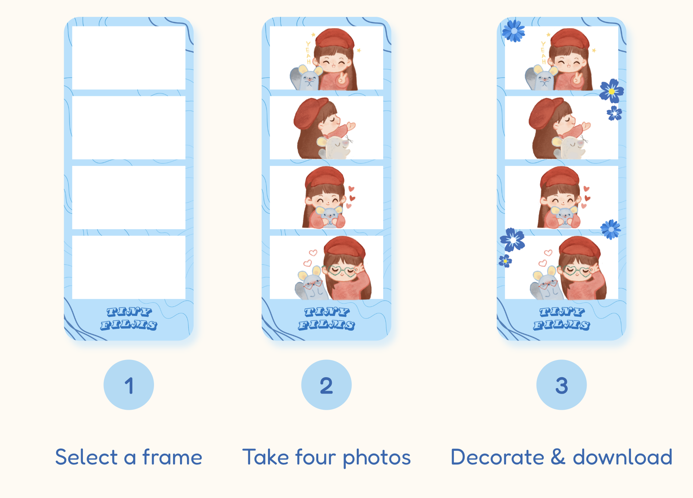

# TinyFilms Photobooth

A browser-based photobooth app where user can pick a film-strip frame, capture or upload photos, then decorate their strip with stickers. Everything is composited live on an HTML5 canvas so you get a downloadable, shareable film strip.

## Features

- Welcome screen with a preview of sample frames and a step-by-step guide
- Frame Selection: browse frames by color theme in a scrollable carousel
- Photo Capture: live webcam capture with a 3-second countdown, or upload your own photos
    - Camera filters: apply a live camera filter (e.g. B&W, vintage etc) for photo capture
    - Redo — remove the last photo and recapture if you're not happy with it
    - Drag-and-drop editing: position photos within their slots after capture
- Sticker Decoration:
    - Add, drag, select and delete stickers on your film strip
    - Keyboard support: delete a selected sticker using Backspace/Delete
    - Date-stamped download: final film strip's filename automatically dated too
- Fully responsive: usable across desktop, tablet, and mobile including a stacked layout and scrollable controls on smaller screens
- Loading and permission states: a spinner while the camera connects and a clear fallback message (with upload option) if camera access is denied

## Tech Stack

- Frontend: React, HTML, CSS
- Camera access: react-webcam
- Image compositing: HTML5 Canvas API

## Getting Started

Currently, the app runs at `https://tiny-films.vercel.app`.

> **Note:** Your browser will ask for camera permission on first use (this is required for the webcam capture feature to work).

## Usage

1. **Select a frame** from the carousel on the home screen.
2. **Take or upload 4 photos** to fill the frame's photo slots
3. Once all 4 slots are filled, you're moved into **decorate mode** where you pick stickers and drag them anywhere on your strip.
4. Click a sticker to select it (shown with a pink outline), then press `Delete`/`Backspace` to remove it.
5. Click download to get a png of your film strip.
6. Use the **Back** button to return to the previous step at any time.

## Further Implementation
- [ ] Save to history (view and revisit past film strips)
- [ ] Sticker resizing via drag handles
- [ ] Touch support for dragging photos/stickers on mobile

## Credits
Designed in Figma and Canva using 
- Fonts: Nunito, Fredoka, Magnifico Daytime ITC.
- Icons: Canva, Freepik.
